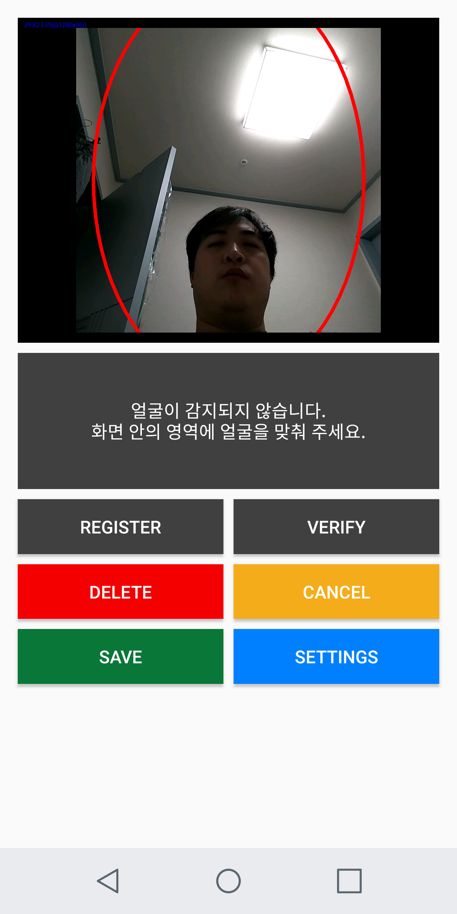
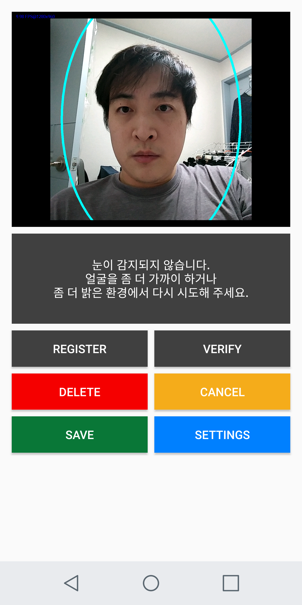
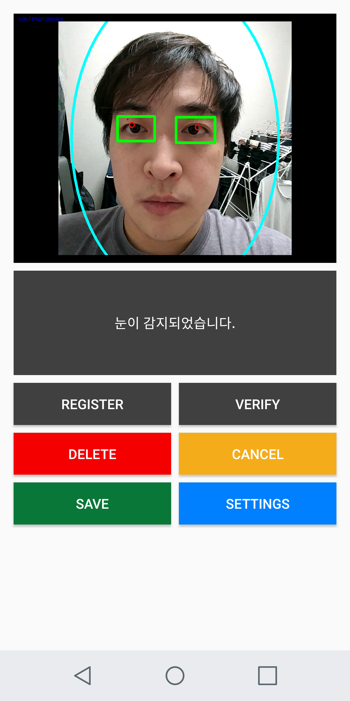

# PupilDetection

## APK

## Description
This app demonstrates pupil detection using OpenCV library's cascade detection and minMaxLoc features.

### Detection Procedure
1) detect frontal face
2) detect eyes
3) per eye, get minLoc value

## OpenCV
Due to it's size, the library is not included in this project. You need to import OpenCV library yourself.

## Screenshots
  

## TO-DO
- Kotlin conversion
- CameraApi2 shutter implementation